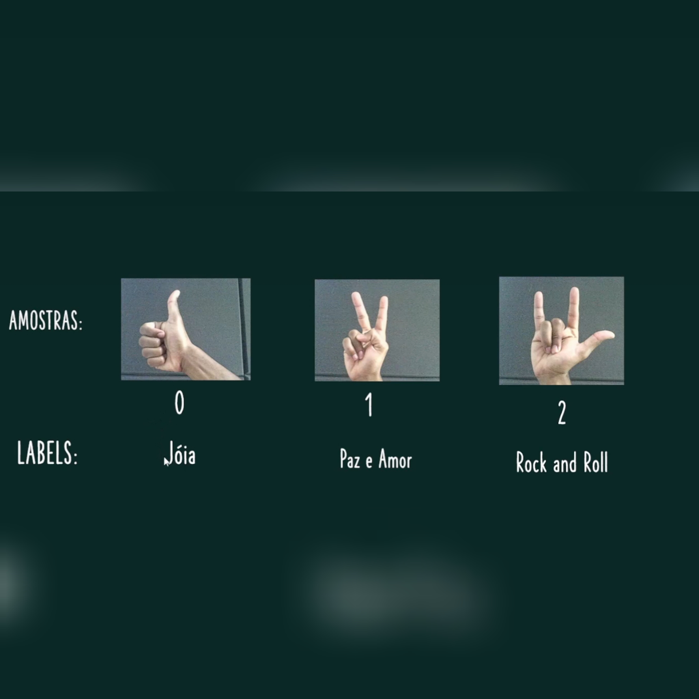
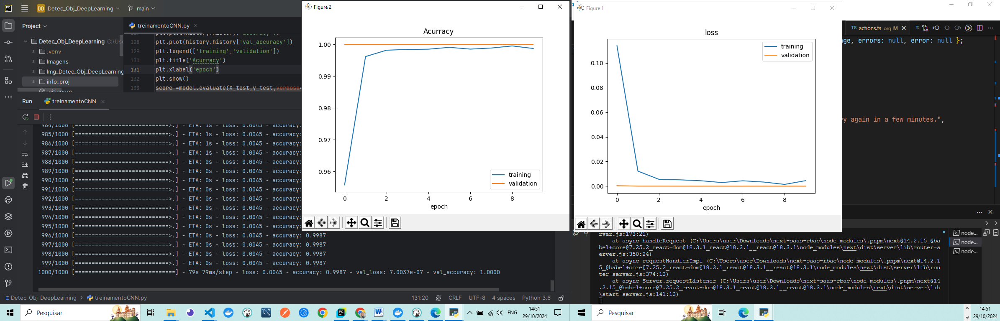
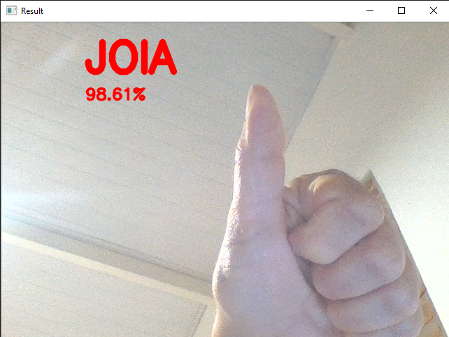

<h2 align="center"> 💻 Detec_Obj_DeepLearning </h2>

# Image Classification Model

This repository contains code for an image classification model using a Convolutional Neural Network (CNN) with Keras and TensorFlow. The model is designed to identify and classify images into different classes.

<h4 align="center">Detec_Obj_DeepLearning 🚀</h4>

<div align="center">
    
    
  <br/>
  <br/>
   
    
   <br/>
  <br/>
   
    

      <br/>
  <br/>
   
    
</div>

---


## Requirements

To run this project, the following libraries and versions are recommended:

- OpenCV (for image capture and processing)
- Keras 2.3.1 and TensorFlow 2.0.0 (for neural network training)
- Numpy (for data manipulation)
- Matplotlib (for plotting training history)

- Use the following command to install the libraries:

```python
pip install matplotlib keras==2.3.1 tensorflow==2.0.0 scikit-learn numpy opencv-python
```

---

### Project Structure

The project is organized into three main code files:

 - captura.py - Captures and saves images from the webcam.
 - treinamentoCNN.py - Processes images, builds, trains, and saves the CNN model.
 - testeModelo.py - Loads the trained model and performs real-time gesture predictions.

---

## Project Overview 🚀

1. Image Capture (captura.py)
This script opens the webcam and captures images to build a dataset for training. Key points:

 - OpenCV: Used to access the webcam and capture frames.
 - Image Resize: Resizes images to 32x32 pixels to balance processing speed with recognition accuracy.
 - File Saving: Saves images to Imagens/1/ folder, naming them sequentially for easy management.

---

2. Model Training (treinamentoCNN.py)
This script opens the webcam and captures images to build a dataset for training. Key points:

  - This script builds and trains a CNN model to recognize hand gestures from the images collected in the previous step.

#### Libraries Used:

 - Keras for building and training the CNN model.
 - TensorFlow optimizer Adam (used to minimize loss and enhance accuracy).
 - Matplotlib for visualizing the model’s training history.
   
 #### Core Functions:

 - Image Preprocessing: Converts images to grayscale, normalizes pixel values, and equalizes histograms for consistent lighting.
 - Data Splitting: Divides data into training, validation, and test sets (80% training, 20% test).
 - Image Augmentation: Uses ImageDataGenerator to generate variations, improving generalization.

 #### Training Configuration:

 - epochs_val=10: Sets the number of training epochs.
 - batch_size_val=50: Defines batch size for training, balancing memory use and accuracy.
 - Saves the model as modelo.h5.

 ---


3. Real-Time Gesture Prediction (testeModelo.py)
This script uses the trained model to predict hand gestures in real-time.

 - OpenCV: Captures images from the webcam for prediction.
 - Model Loading: Loads the trained CNN model from modelo.h5.
 - Preprocessing: Applies the same preprocessing steps as during training (grayscale, equalization, normalization).
   
#### Prediction:
 - Assigns probability values to each gesture category.
 - Displays the gesture name and probability on the video feed.


---

## Model Details

The CNN model has the following structure:

 1 - Convolutional Layers: Two layers to extract essential features of gestures.
 - Conv2D with relu activation for non-linearity.
 - MaxPooling2D for down-sampling to reduce dimensionality.
2 - Dropout Layers: To prevent overfitting, 50% of neurons are dropped in the second layer.
3 - Flatten Layer: Transforms data to a 1D array for the dense layer.
4 - Dense Layers: Final classification using softmax activation.

---

## Notes

 - Training Time: Training takes around 20-30 minutes depending on system specs.
 - Image Dimensions: Each image is resized to 32x32 pixels for compatibility with the model.
 - Folder Structure: Ensure images are saved in the appropriate folders under Imagens/ with each folder representing a class label.

---

## References

 - OpenCV documentation for capturing video and image processing.
 - Keras and TensorFlow for CNN model implementation.
 - Matplotlib for generating loss and accuracy graphs during training.

---

## Installation

1 - Clone the:bash repository
```python
git clone https://github.com/seu-usuario/reconhecimento-gestos.git

```

---

1 - Install the dependencies:
```python
bashpip install -r requirements.txt

```


## License

This project is licensed under the MIT License. See the `LICENSE` file for more details.

---


### 📦 Contribution

 - Feel free to contribute by submitting pull requests or reporting issues.

- #### My LinkedIn - [](https://www.linkedin.com/in/lucianadiemert/)

#### Contact


#### [**Luciana Diemert**](https://github.com/ludiemert)

🛠 Full-Stack Developer <br>
🖥️ Python Enthusiast | Computer Vision | AI Integrations <br>
📍 São Jose dos Campos – SP, Brazil

<a href="https://www.linkedin.com/in/lucianadiemert" target="_blank"></a>&nbsp;
<a href="mailto:lucianadiemert@gmail.com" target="_blank"></a>&nbsp;
<a href="#"></a>&nbsp;
<a href="https://www.github.com/ludiemert" target="_blank"></a>&nbsp;

<br clear="left"/>


